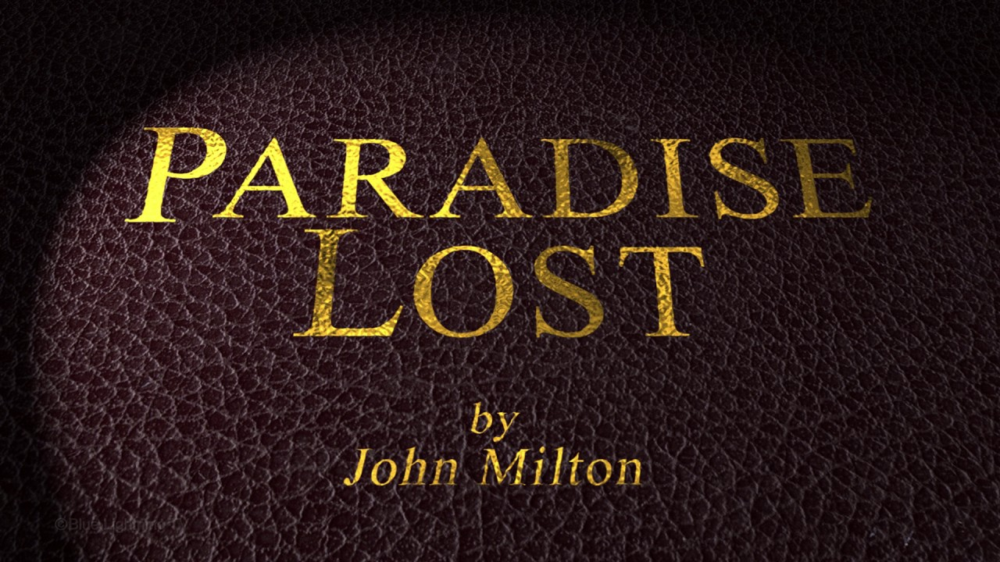
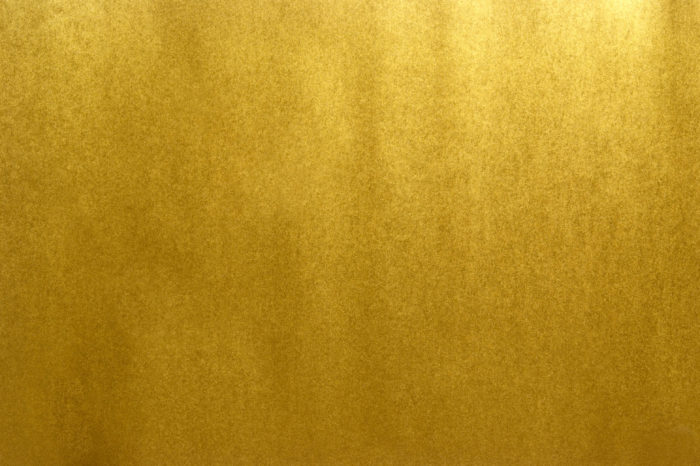
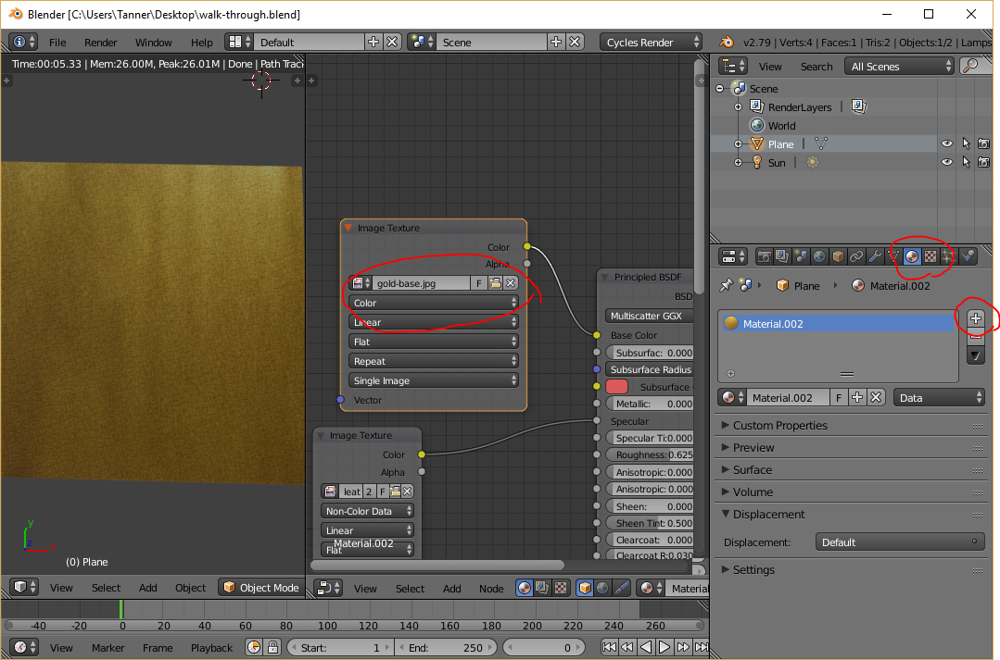
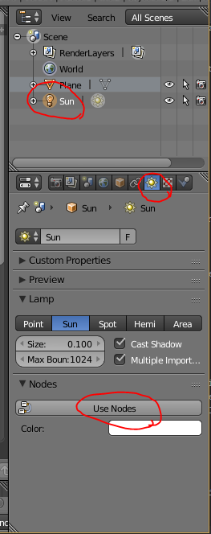
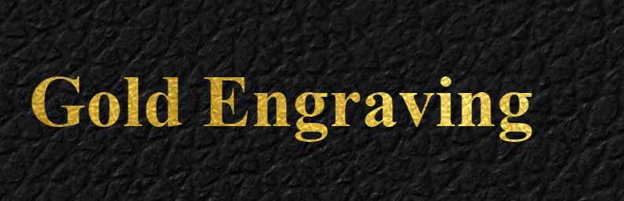
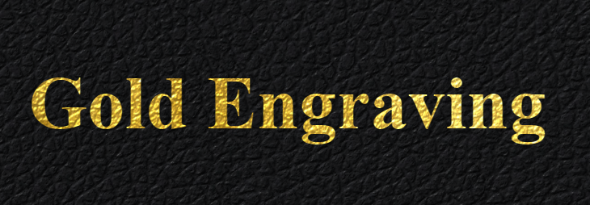

import Admonition from '../../../src/components/admonition';
import VideoEmbed from '../../../src/components/video-embed';

I love the look of gold-engraved leather.  You see it all the time on portfolios, diplomas, etc., and I think the reason is because it really does have a universal appeal.  However, you don't see it so often on the web.  Perhaps it just doesn't fit with the flat style that dominates the internet.  Or maybe (most likely) it's because the effect cannot easily be pulled off in CSS.

Traditionally, if you wanted to include something like the above image on your website, you'd be forced to create it with Photoshop or other external software, then include the image in the HMTL.  If you ever want to change the text, resize or change the font, you would have to create it all again.  Additionally, you probably need to keep track of multiple sizes and layouts for different display sizes...  Not worth the hassle unless you _really_ need the effect.

So what can a poor developer do?  Luckily, with a few CSS tricks and clever texturing, there is in fact a way to mimic this lovely style yourself, without sacrificing flexibility!  And:

* It works with _any_ text (even emojis to an extent 😲)
* It work with _any_ font (including [Font Awesome](https://fontawesome.com/), or a similar font-based icon system)
* Both the text and font can change on the fly without messing up the effect

Today, I will walk you through my process so you can create the effect on your own, and I'll even give away the special Blender-made textures at the end of the article.  It's a bumpy road ahead, but hopefully you find something useful along the way.

## Breaking it down: How does it work?
Before we can get to work, we need to briefly break down how the effect is pulled off.  There are several key pieces to note:

1.  [Normal mapping](https://en.wikipedia.org/wiki/Normal_mapping) on the gold texture (the one part that must be pre-made) makes it look as though the gold is "painted" directly on the leather.  Without this effect, the gold just looks wrong.
2.  [`background-clip: text`](https://developer.mozilla.org/en-US/docs/Web/CSS/background-clip) allows us to clip the gold texture to the shape of the text.
3.  Multiple `text-shadow`s create the illusion that the text has been pressed into the leather.

I will walk through these effects in the above order, starting with the normal mapping, which is by far the trickiest.

<Admonition type="question">
	If you don't know what a normal map is, <a href="https://www.youtube.com/results?search_query=normal+maps+explained">a YouTube search</a> can probably answer most of your questions.  All you really need to know is that they help 3D software render lighting for geometrically complex surfaces.
</Admonition>

## Step 1 - Creating the Textures
Our first goal is to create leather and gold textures that looks a bit like this:



We will not be creating the actual letters in this step, but notice how the gold is clearly "painted" on to the existing bumps and crevices.  We will be using [Blender](https://www.blender.org/) achieve this effect.

<Admonition type="info">
	If you do not want to go through the hassle of creating your own textures, you can skip sections 1.1 - 1.7, as I will be giving away my textures at the end of the article.  However, if you wanted to go for a slightly different effect, such black text on brown leather, or even red paint on concrete, these steps will be very helpful for you.
</Admonition>

### Step 1.1 - Get Blender
First, you'll want to be sure you have [Blender](https://www.blender.org/download/) installed AND that you have **version 2.79b or later**.  This version has new features that we'll need.

### Step 1.2 - Find your Textures
Next, you need to find a seamless leather texture along with its matching normal map (and optional specular map).  A number of sites provide high-quality textures; [Poliigon](https://www.poliigon.com/) perhaps is the best and most popular, but it's not free for all textures.  [Texturize](http://www.texturise.club/) is another site that provides all textures royalty-free, but the selection is smaller.

Luckily, it had the [kind of leather I was looking for](http://www.texturise.club/2013/12/seamless-black-leather-texture-maps.html).  Go ahead and download the diffuse and normal texture.  You can also download the specular texture if you wish.

<Admonition type="info">
	If you have your own texture and need a normal map for it, there are a number of tools that can generate one for you, <a href="http://cpetry.github.io/NormalMap-Online/">some online</a> and <a href="http://www.crazybump.com/">some for desktop use</a>.  However, you'll want to know what you're doing for these and they're outside the scope of this tutorial.
</Admonition>

### Step 1.3 - Setup the Geometry
Now we can open Blender and start preparing our textures.  This article will assume basic knowledge of Blender, but I will make an effort to be very clear about what I'm doing.

After starting Blender, the first thing we want to do is select everything in the scene (<kbd>a</kbd>) and delete it (<kbd>delete</kbd> , <kbd>enter</kbd>).  Next, let's create (<kbd>shift</kbd> + <kbd>a</kbd>) a new Mesh > Plane and scale (<kbd>s</kbd>) it by 5.  If you accidentally moved the 3D cursor and the plane is off center, you can hit <kbd>n</kbd> to bring up the properties panel and reset the position to 0.  You should have something like this:


Next, let's add a simple directional light to the scene.  In the main view, add (<kbd>shift</kbd> + <kbd>a</kbd>) a new Lamp > Sun.  Pull up the properties panel (<kbd>n</kbd>) once more and set the position of the lamp to (0, 0, 10), just to get it out of the way, and set the rotation to (-20, -20, 0).  You don't need to worry about where the line from the light hits the plane, because the light is only directional.

### Step 1.4 - Setup the Leather Material
Now we need to create and setup a material for our plane that will utilize the leather texture we downloaded earlier.  But before we mess with any materials, we want to make sure Blender is set to "Cycles Render" rather than "Blender Render" (top of the screen).

<Admonition type="info">
If you need any help with the following steps, refer to this excellent video, which is where I got most of my information.  It's a bit long, so I would only refer to it if you run into issues.

<VideoEmbed id="aH6XPsEmozk"/>
</Admonition>

Then, collapse the left-hand panel (<kbd>t</kbd>) to make more room, then split the main view by clicking and dragging to the left from the upper right-hand corner:


Before we can apply our leather textures, we need to UV-unwrap our plane.  This simply allows our textures to be mapped to the 3D geometry, which in our case is just a simple plane.  First, in the new right-hand view, change the type to "UV/Image Editor" in the bottom left.  The view should be blank at the moment.  Then, in the left-hand 3D view, select the plane (right-click) and hit <kbd>tab</kbd> to enter edit mode.  Then hit <kbd>u</kbd> and select "Unwrap" to UV-unwrap our plane.  If all works properly, you should see the UV coordinates in the UV/Image Editor now:


Hit <kbd>tab</kbd> once more to exit edit mode, then change the right-hand editor to "Node Editor," and hit <kbd>n</kbd> to close the properties panel.  This view is where we will edit our leather and gold materials, so click the big "New" button to create a material.  This will give us a default white diffuse material.  To preview how this will look rendered, hover the mouse over the left-hand 3D view and press <kbd>shift</kbd> + <kbd>z</kbd> (which can also be used to flip back to the default 3D view):


Not much to see at the moment.  Let's select the "Diffuse BSDF" shader (right-click) and delete it.  We'll need a more complex shader for our material:  Hit <kbd>shift</kbd> + <kbd>a</kbd> and add a Shader > Principled BDSF node.  Do not be intimidated by all the options!  Just start by connecting the green BDSF output to the Surface input on the Material Output node.  Once you do that, the rendered view should look the same as it did with the default diffuse shader.


Now we need to add (<kbd>shift</kbd> + <kbd>a</kbd>) a Texture > Image Texture node.  Click the Open button and find the leather texture you downloaded (the one that looks like normal leather).  After that, you can connect the color output on the image texture to the input on the Principled BDSF, and you will see the leather texture in the rendered view:


This does look like the leather, but you can see that it doesn't quite look right -- the light isn't interacting with the bumps of the leather.  Of course, that shouldn't be too surprising, because we simply told Blender to slap an image on a flat plane; it doesn't know what the bumps look like.  This is where normal maps come in:

Let's add (<kbd>shift</kbd> + <kbd>a</kbd>) another Texture > Image Texture node, and open the normal map (the blue/purplish image) that accompanies the leather texture.  Even though the normal map is technically an image, it's not meant to be displayed as such, so change the "Color" drop down to "Non-Color Data."  We want to pipe this texture into the purple Normal input at the bottom of the Principled BSDF shader, but we must convert the color input to normal data beforehand.  So let's create another node (<kbd>shift</kbd> + <kbd>a</kbd>) and select Vector > Normal Map.  Finally, connect the color output of the image texture to the normal map, and send the normal map output to the Normal input on the Principled BSDF shader.  After all of that, you should be able to see that the leather now has some texture:


If you have a specular map as well, you can add (<kbd>shift</kbd> + <kbd>a</kbd>) another Texture > Image Texture, open the specular map file, set it to "Non-Color Data", and connect the output into the Specular input on the Principled BSDF shader.  The effects of this are more subtle and not strictly necessary.  You can also tinker with the roughness slider to achieve similar effects.  For me, I had to turn up the roughness to make the leather not look so plastic-like.  You may also want to turn up/down the strength of the sun lamp.  It's all a matter of preference.  Once you're satisfied, you can rotate the camera (middle-mouse-button drag) to see what the plane looks like from above, as we'll see it in the HTML:


### Step 1.5 - Bake the Composite Leather Texture
Now that we have a model of what our leather should look like in 3D space with 3D lighting, we can "bake" the result to another texture that we can use in HTML.

If you need any help with the following steps, refer to this video, which covers the basics of Cycles baking.  Again, it's long, so I would only refer to it if you run into issues.

<Admonition type="info">
If you need any help with the following steps, refer to this excellent video, which is where I got most of my information.  It's a bit long, so I would only refer to it if you run into issues.

<VideoEmbed id="sB09T--_ZvU"/>
</Admonition>

Let's start by switching our left-hand view to "UV/Image Editor."  Then click the big "New" button at the bottom to create a new image for our texture to be baked onto.  Make sure the image is the same dimensions as the original textures, and uncheck alpha, because we won't need it:


Next turn your attention to the far right-hand side of the screen, where there are a bunch of options pertaining to rendering.  Scroll down and find the "Sampling" section.  Within, there are two numbers for samples: one for render and the other for preview.  The "Render" one is relevant to rendering and baking, so this number concerns us.  This is effectively the quality of our render, so crank that up to 250 or so.  The higher you go, the longer it will take.

Keep scrolling to the bottom and expand the "Bake" section, which has a big "Bake" button.  This will launch the baking process, but first we need to let Blender know where to bake the texture to.  In the node editor, <kbd>shift</kbd> + <kbd>a</kbd> to create another Texture > Image Texture.  This node will not be connected to anything; it will only serve to tell Blender where to bake our texture.  On the image texture node, select the blank image we created just a moment ago (don't open a file).

Finally, with the orphan image texture node selected (it _must be selected_ or you will overwrite one of your original textures), you can hit the big "Bake" button.  This process may take a few minutes:


After that's complete, you should see the rendered result in UV/Image Editor view.  To save the image, click "Image" at the bottom and select "Save as Image".  You should now have an image file that looks something like this:


### Step 1.6 - Setup the Gold Material
Now we need to create a gold material that has the same normal mapping as the leather, which will make it look as though the gold has been painted on top of the leather.  Luckily, we can leverage the work we just did so we don't have to do it all again.

First, change the left-hand view back to 3D view and turn on live rendering (<kbd>shift</kbd> + <kbd>z</kbd>) so we can see the material as it changes.  Next, we need to find a gold texture somewhere online, and preferably a seamless one.  Unlike the leather, we won't need any normal maps or specular maps, because we will just be using the ones from the leather.

Metallic textures can be tricky because we don't want a texture that already has the reflections built in; Blender will calculate the reflections based on the leather normals.  Try to find a relatively flat texture, perhaps like this one:



Now let's load the gold texture into blender.  First, we need to duplicate the leather texture since the gold texture will be very similar.  Over on the right-hand side of the screen, go to the Material tab, and click the plus button to create a new material, and the node setup from the old material will automatically be copied.  Now back up on the image texture node that's plugged into the base color, swap out the leather image with the gold one you just downloaded.  If all goes well, you should see something like this:



Now we begin a game of tweaking:  First, slide the "Metallic" slider on the Principled BSDF shader all the way up.  (It is metal, after all!)  You can also make it look more metallic by decreasing the roughness (0.4 looked good in my particular case).  Things are looking a little dark a little dark for me, so let's crank up the sun a bit.  To do this, select the sun lamp in the scene hierarchy on the right-hand side, select the data tab, then scroll down and click the "Use Nodes" button.



After doing so, you will have a strength parameter that you can now increase.  There's no magic number; just make it as bright as you'd like.  Unfortunately, there are several parameters without magic numbers: the sun strength, the roughness, and the normal map strength, which can be found on the Normal Map node in the node editor.  I went through several iterations to get things right, but in general, you will probably want a low normal strength (because the painted gold would "smooth" the crevices slightly) and you don't want the gold to be too bright (which is influenced by all three factors), or it will look odd in contrast to the leather.  Trial and error is the only way:


Even though the last iteration looks a little dull, it ended up looking the best when I used it for gold text, so keep that in mind when choosing your parameters.

### Step 1.7 - Render the Gold to a Texture
One complication we have to deal with now is that due to the nature of Cycles baking, reflections and such can't be baked directly to textures, because the reflections depend on viewing angle.  So instead of baking the gold texture, we will setup an overhead camera and use that to render the texture.

Assuming you're happy with the gold material, you can turn off live rendering (<kbd>shift</kbd> + <kbd>z</kbd>) and go back to one view:


Next, (<kbd>shift</kbd> + <kbd>a</kbd>) and create a camera.  Open the properties panel (<kbd>n</kbd>) and with the camera selected, set the position to (0, 0, 10), and the rotation to (0, 0, 0), so our camera points straight down at the plane.

Now over on the right-hand side of the screen, click the camera tab, change the camera to orthographic, and set the orthographic scale to 10.  (Since we are rendering to a texture, we don't want perspective to skew anything.)


Finally, to get the aspect ratio correct, head over to the Render tab and adjust the resolution to match the size of the leather texture we created earlier:


If you want to get a rough idea of what the final render will look like, hit <kbd>0</kbd> on the numpad to snap the viewport to the camera's perspective, and hit <kbd>shift</kbd> + <kbd>z</kbd> to preview the render.  You may find that at this angle, you will have to re-adjust the gold material parameters from before.  Be sure to adjust based on this view because this is the one that will be rendered!

Once you are happy with how it looks, you can hit the big render button and go grab a coffee or something -- it will take awhile.  Once it's done, you can save the image to a file like we did with the leather texture (and don't forget to save! Blender will not save the render if you close out).  If all goes well, you should have a gold texture that looks a bit like this:


## Step 2 - Adding the Textures to HTML
Now we are finally done with Blender (thank goodness!), and we have two images: a leather image, and a gold image with texturing that matches the leather.  Using these two images, we can make it look like the gold is painted on the leather.

Let's start with some basic markup:
```html
<div class="leather textured">
  <h1 class="gold textured">Gold Engraving</h1>
</div>
```

That's all the markup we'll need for now.  Let's take a look at the CSS, starting with the `leather` class:
```css
.leather {
  background-image: url(leather-texture.png);
  padding: 1em;
}
```

This simply sets the background to the leather texture we created and gives us a little extra padding.  Easy so far.  Now let's look at the `gold` class:
```css
.gold {
  background-image: url(gold-texture.png);
  background-clip: text;
  -webkit-background-clip: text;
  color: transparent;

  font-size: 70pt;
}
```

Here, we set the `background-image` to our gold texture, but we set the `background-clip` property to `text` (along with the -webkit prefixed version).  This clips the background so it only displays in the bounds of the text.  However, the text would cover it up by default, so we set `color: transparent` to hide the actual text.

With that, we get something that looks like this:



Not quite what we're looking for... The textures don't line up with each other and the leather is much too big.  So, let's fill in the third class I alluded to in the markup:
```css
.textured {
  background-position: fixed;
  background-size: 900px 900px;
}
```

This simply ensures that both textures will be the same size and align with each other.  It's difficult to see since the gold texturing is so subtle, so here's a version with an exaggerated gold texture so you can see that it really does line up:



## Step 3 - Pressing the Gold Text
Lastly, we need to add some special text shadows to give the illusion that the text has been "pressed" into the leather and not just a gold sticker on top of the leather.  The following picture illustrates how we can use shadow to create this illusion:


Here we have a shape pressed into a surface with the light coming from the upper left, just like our textures.  You will notice that the upper and left edges are darker because they are obstructed from the light source, and the bottom and right edges are brighter because they are angled more directly towards the light.  Using two text shadows, we can do the same thing.  It takes some tweaking, but something like this works fairly well:
```css
.gold {
  text-shadow: -3px -3px 5px rgba(0,0,0,.8), 1px 1px 2px rgba(255,255,255,.45);
}
```

...but according to the [MDN docs for `background-clip`](https://developer.mozilla.org/en-US/docs/Web/CSS/background-clip#Browser_compatibility), several browsers won't render text-shadows properly when `background-clip: text` is used on the same element.  This can be a pain in the butt because the only way to get around this is to put the shadows on a separate element.  One option to make this less cumbersome is to use the `::before` and `::after` pseudo elements, and have them read from a common attribute.  It's easier to understand in code, so let's revise our markup:

```html
<div class="leather textured">
  <h1 class="gold textured" data-text="Gold Engraving"></h1>
</div>
```

Notice that the text is now entirely within an attribute.  This allows us to access the text via the [`attr()` CSS function](https://developer.mozilla.org/en-US/docs/Web/CSS/attr) to automatically duplicate the text across our two pseudo elements (one for the gold, and one for the shadow).

Now let's revise the `gold` class.  This gets a little hairy, so I will break down each part:

```css
.gold {
  position: relative;
  font-size: 70pt;
}
```

The actual `.gold` element now just serves as an anchor for our `::before` and `::after` elements.  Since there will be absolute positioning involved with the pseudo elements, we need to set `position: relative` here.

The `::before` element will serve as our shadow element, since it needs to sit behind the gold:

```css
.gold::before {
  content: attr(data-text);
  text-shadow: -3px -3px 5px rgba(0,0,0,.8), 1px 1px 2px rgba(255,255,255,.45);
}
```

Here is where the magic `attr()` function comes into play.  By loading the `data-text` value into the `content` property, we have effectively inserted the text into the element, as if it were `<h1>Gold Engraving</h1>`.  Since this element isn't using `background-clip: text`, we are free to add our shadows here.

The `::after` element will serve as the gold text element:

```css
.gold::after {
  content: attr(data-text);
  position: absolute;
  left: 0;
  top: 0;

  background-position: inherit;
  background-size: inherit;
  background-image: url(gold-texture.png);
  background-clip: text;
  -webkit-background-clip: text;
  color: transparent;
}
```

Here the background-image stuff is the same as before, only now we get our text content from `attr(data-text)`, just like `::before`.  Then, to get the gold to sit directly on top of the shadow, we use absolute positioning.

And that's it!  You can check out the results in this Fiddle:

<iframe width="100%" height="300" src="//jsfiddle.net/tannerntannern/3xr8mLf6/embedded/html,css,result/" allowfullscreen="allowfullscreen" allowpaymentrequest frameborder="0"></iframe>

## Conclusion
There you have it!  Hopefully this article was insightful, and perhaps you can build upon these techniques to do other effects as well.

As promised, here are the <a href="leather-texture-bake.png" target="_blank">leather</a> and <a href="gold-texture-bake.png" target="_blank">gold</a> textures for your convenience.  Feel free to use them however you'd like. 😃
