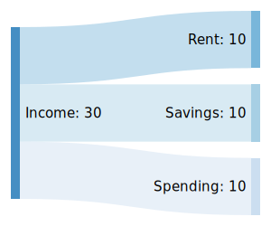
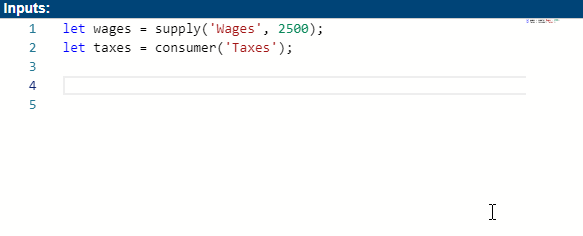
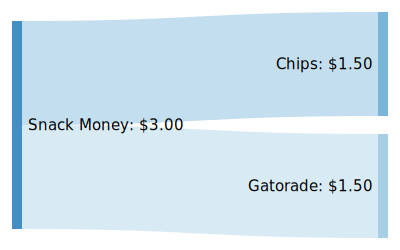
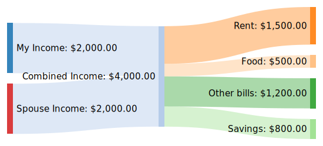
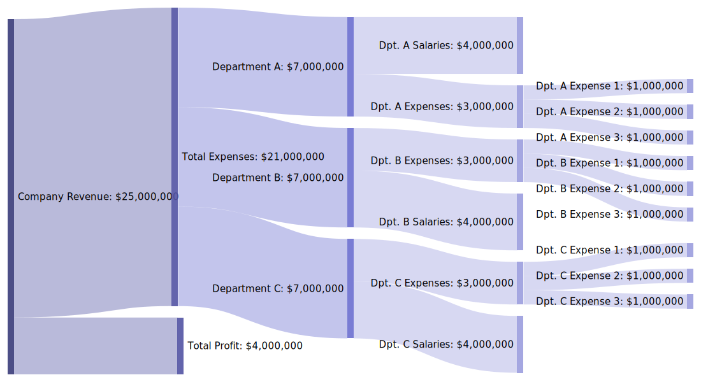
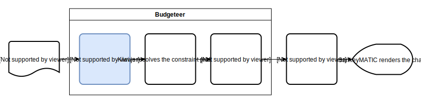

You can gain some useful insights by visualizing your budget, but creating a chart like the one above this isn't always worth the effort.  That's why I created a tool called [Budgeteer][3] that makes it easy make these charts without tedious work.  In this post, I'd like to talk a little bit about how to use the tool as well as some of the math behind it.

* [Click here](#using-the-budgeteer-website) if you just want to learn how to use the tool
* [Click here](#appreciating-the-underlying-math) if you're interested in the underlying math

# Motivation
Before I continue I must give credit to [Steve Bogart][5] who created the [original SankeyMATIC][4] tool that this project is based on.  It's an excellent tool and may even suit your needs better than Budgeteer for simple use cases.

## Problems with SankeyMATIC
However, what I didn't like about SankeyMATIC (and other tools like it) is that modelling flows is a bit inflexible.  For example, consider the following:



The code to generate this diagram with SankeyMATIC is simple:

```
Income [10] Rent
Income [10] Savings
Income [10] Spending
```

However, this code doesn't capture the _logic_ of these flows; it only describes _results_.  What would be much better is something like this:

```
Income = supply(30)
Rent.consumes(10).from(Income)
Income.supplies(10).to(Savings)
Income.suppliesRemaining().to(Spending)
```

There's a much different intent communicated here:
* It emphasizes that "Income" is a fixed supply with a specific amount
* It describes "Rent" as "consuming" income as opposed to "being supplied by" income
* It suggests that "Spending" is lower priority than rent and savings as it just gets "the leftovers"

This "leftovers" feature would be very nice for making complicated flows.  Calculating differences is easy for trivial flows like this, but it becomes unwieldy with more complicated flows like the one shown at the top of this post.

## Enter Budgeteer
In a nutshell, this more expressive syntax and auto-calculated differences is what [Budgeteer][3] provides.  Budgeteer does not replace SankeyMATIC, but rather builds directly on top of it; it acts as a middleman, translating a more expressive JavaScript-based API into the code that SankeyMATIC understands.

> Technically, [Budgeteer is a separate, standalone TypeScript package][1] that can operate outside of SankeyMATIC, but it can only be used programmatically.  [Budgeteer + SankeyMATIC][3] is the website that integrates it into a graphical tool like SankeyMATIC.  See the [repository for the website][2] if you want to learn more.

With that lengthy intro out of the way, let's jump into using the [Budgeteer Website][3]!

# Using the Budgeteer Website
If you know how to use [SankeyMATIC][4], you already know most of [Budgeteer][3].  The only substantial change is how your code translates into a diagram, which is what I'll focus on.

## Budgeteer's Language
Budgeteer understands JavaScript, which is great if you already know JavaScript, but not so great if you don't.  To mitigate this, I designed the API to read like spoken English as much as possible.  Additionally the code editor on the website will help you out a lot as you type:



## Main Concepts
Budgeteer has just a few main concepts.  Understanding them before making a diagram is helpful, but if you'd rather learn by example, skip to the [examples section](#Examples).

### Nodes
Each point where flows connect on the chart is a "node."  There are three types of nodes:

1. **Supplies** - Nodes with a fixed supply that only give resources to other nodes
2. **Consumers** - Nodes that only consume from other nodes
3. **Pipes** - Nodes that both consume from and supply other nodes

Nodes that can consume from other nodes (and thus receive supply) are called _supplyable_.  Nodes that can supply other nodes (and thus be consumed) are called _consumable_.

This means (somewhat confusingly) that **supply** nodes are _consumable_, **consumer** nodes are _supplyable_, and **pipe** nodes are both consumable _and_ supplyable.

> Knowing this terminology isn't required for using the tool, but may be helpful if you start digging into the technical side of the API.

### Node Relationships
There are three types of relationships a node can establish with another:

1. `A.supplies(<amount>).to(B)` or `B.consumes(<amount>).from(A)`

	One node supplies a fixed amount to another.
2. `A.suppliesAsMuchAsNecessary().to(B)` or `B.consumesAsMuchAsNecessary().from(A)`

	One node supplies only as much as the other needs.
3. `A.suppliesAsMuchAsPossible().to(B)` or `B.consumesAsMuchAsPossible().from(A)`

	One node gives whatever it can to the other.

## Examples
The default example code on the [Budgeteer Website][3] pretty much includes all of budgeteer's features.  Feel free to skip these examples that's enough for you to get the gist.

### Basic Use: Supplies and Consumers
Supplies and consumers are the basic building blocks of any model in budgeteer.  Here's an example:

```javascript
let snackMoney = supply('Snack Money', 3.00);

consumer('Chips').consumes(1.50).from(snackMoney);
consumer('Gatorade').consumes(1.50).from(snackMoney);
```



If you prefer to think of snack money as a supply rather than an object of consumption, you could also write it this way, which results in the exact same diagram:

```javascript
supply('Snack Money', 3.00)
    .supplies(1.50).to(consumer('Chips'))
    .supplies(1.50).to(consumer('Gatorade'));
```

### Variable Supply and Consumption
You may encounter some situations where you'd rather leave a value unspecified.  Here's an example of how you might do that:

```javascript
let time = supply('Hours of the day', 24);

consumer('Sleep').consumes(8).from(time);
consumer('Morning Routine').consumes(1).from(time);
consumer('Commute').consumes(0.5).from(time);
consumer('Work').consumes(8).from(time);

time.suppliesAsMuchAsPossible().to(consumer('Free time'));
```


Notice how "Free time" is not supplied with a specific amount but rather with "as much as possible," which happens to be 6.5 in this case.  Now suppose you decide to start biking to work which takes twice as long.  That brings your commute up to an hour and your free time down to 6.  Rather than update both values, you can just update the one that changed (your commute), and the free time will automatically adjust.

### Using Pipes
Some models require going beyond basic supplies and consumers, which is where pipes come in.  Pipes are useful for pooling or grouping resources:

```javascript
let combinedIncome = pipe('Combined Income');

supply('My Income', 2000).suppliesAsMuchAsPossible().to(combinedIncome);
supply('Spouse Income', 2000).suppliesAsMuchAsPossible().to(combinedIncome);

consumer('Rent').consumes(1500).from(combinedIncome);
consumer('Food').consumes(500).from(combinedIncome);
consumer('Other bills').consumes(1200).from(combinedIncome);
consumer('Savings').consumesAsMuchAsPossible().from(combinedIncome);
```



Pipes are especially useful with the `asMuchAsNecessary` relationship.  Here's a more complex, but practical example:

```javascript
const SALARY = 80_000;
const WORKERS_PER_DEPARTMENT = 50;
const DEPARTMENT_SALARIES = SALARY * WORKERS_PER_DEPARTMENT;

let revenue = supply('Company Revenue', 25_000_000);
let expenses = pipe('Total Expenses');
let profit = consumer('Total Profit');

revenue
    .suppliesAsMuchAsNecessary().to(expenses)
    .suppliesAsMuchAsPossible().to(profit);

expenses
    .suppliesAsMuchAsNecessary().to(makeDepartment('A'))
    .suppliesAsMuchAsNecessary().to(makeDepartment('B'))
    .suppliesAsMuchAsNecessary().to(makeDepartment('C'));

// since this is just JavaScript, you can use functions to speed things up!
function makeDepartment(name) {
    let department = pipe(`Department ${name}`);
    let departmentExpenses = pipe(`Dpt. ${name} Expenses`);

    department
        .supplies(DEPARTMENT_SALARIES).to(consumer(`Dpt. ${name} Salaries`))
        .suppliesAsMuchAsNecessary().to(departmentExpenses);

    departmentExpenses
        .supplies(1_000_000).to(consumer(`Dpt. ${name} Expense 1`))
        .supplies(1_000_000).to(consumer(`Dpt. ${name} Expense 2`))
        .supplies(1_000_000).to(consumer(`Dpt. ${name} Expense 3`));

    return department;
}
```



Notice how neither the company's total expenses or profit, nor the departments' total expenses are specified -- instead, Budgeteer figures out what the values should be behind the scenes.  This is by far the most useful addition that Budgeteer brings to SankeyMATIC.

## Complete API Reference
That's enough examples for now.  This article is meant to provide a basic overview of the Budgeteer API.  If you would like a more complete, technical reference, check out the [budgeteer repository][1].

## Exporting Your Chart
The original SankeyMATIC tool had both PNG and SVG export options.  Unfortunately, PNG rendering didn't seem to work on my copy of the code and frankly, it wasn't worth it for me to figure it out.  So you'll have to use SVG, but hey, SVG is better anyway.

***

# Appreciating the Underlying Math
Trying to figure out the math of balancing these flow networks is what originally plunged me into this project.  The problem is deceivingly simple, which is why I originally thought I could just hack up some JavaScript to spit out the SankeyMATIC code for my personal use.  However, after several evenings after work spent on trying to develop a good algorithm, I realized it was a trickier problem than I had realized, so I decided to take a different approach.

In college, I was briefly acquainted with [constraint solvers][6].  If you aren't familiar with constraint solvers, they essentially just take a bunch of variables and constraints, and produce a set of values for the variables that satisfy the constraints.  After wrestling with the flow balancing problem for awhile, it became clear that a constraint solver ([kiwi.js][7] in my case) would be a good tool for the job.

But the whole reason I went down this rabbit hole was to develop an alternative to SankeyMATIC's rigid and cumbersome language.  Just using a constraint solver wasn't the answer, because specifying variables and constraints is _way more_ cumbersome and difficult to read.  So instead, Budgeteer acts as a translator:



This highlighted section above is where all the interesting stuff happens, so that's what I'll be talking about.

## Definitions
In constraint-solving land, everything is a variable.  This means that the amount of resources at each node gets its own variable, and the amounts transferred between it and every other node all get their own variables too... That's a lotta variables.  To keep things straight, let's setup some definitions:

| Symbol | Definition |
| ------ | ---------- |
| $B_i$ | The numeric balance at node $i$  |
| $T^i_j$ | The numeric amount transferred from node $i$ to node $j$ |
| $C_i$ | The set of nodes that consume from node $i$ |
| $S_i$ | The set of nodes that give supply to node $i$ |

### Visual Definitions
If you prefer to think visually, this may help you:
<!-- https://www.jmilne.org/not/Mamscd.pdf -->

$$
\require{AMScd}
\begin{CD}
    a @>{T^a_b}>> b\\
    @V{T^a_c}VV @VV{T^b_d}V\\
    c @>>{T^c_d}> d
\end{CD}
$$


Given the previous information, the following statements would also be true:


$$
S_a = \emptyset, C_a = \{b, c\}\\
S_b = \{a\}, C_b = \{d\}\\
S_c = \{a\}, C_c = \{d\}\\
S_d = \{b, c\}, C_d = \emptyset
$$


## Turning Flows into Constraints
With definitions out of the way, we can start to reason about how budgeteer code will translate to constraints.  For example, what does it mean to define a supply node, or a consumer, or a pipe with constraints?  Let's start with supplies:

### Creating Supplies
```javascript
let x = 1000;
let s = supply('Supply', x);
```

In the context of balancing budgets we want to make sure that our supply is not overdrawn, so our constraints will look like the following:

$$B_s \geq 0, B_s = x - \sum_{i \in C_s} T^s_i$$

This defines the balance for the supply, $s$, to be the initial amount, $x$, minus the sum of transfers to each node that consumes from the supply, additionally stipulating that it not dip below 0.  In other words, what the supply has left is what it started with minus the amount that the other nodes took from it.

### Creating Consumers
```javascript
let c = consumer('Consumer');
```

The balance for a consumer is simply the sum of transfers coming in from its suppliers:

$$B_c = \sum_{i \in S_c} T^i_c$$

### Creating Pipes
```javascript
let p = pipe('Pipe');
```

Pipes have both suppliers and consumers.  In the context of balancing flows, we want the inputs and outputs to cancel out, which means we want the balance to be 0:

$$B_p = 0, B_p = (\sum_{i \in S_p} T^i_p) - (\sum_{i \in C_p} T^p_i)$$

This defines the balance for the pipe, $p$, to be the sum of transfers *from* each node that supplies it, minus the sum of transfers *to* each node that consumes from it, which should cancel out to 0.  In other words, the pipe should be given the same amount from its suppliers that it gives away to its consumers.

### Transferring a Fixed Amount
```javascript
let s = supply('Supply', 1000);
let c = consumer('Consumer');
let x = 500;

c.consumes(x).from(s);
```

With those constraints specified upfront, establishing relationships is actually pretty straightforward.

$$s \in S_c, c \in C_s, T^s_c = x, T^s_c = -T^c_s$$

Here we are just saying that $s$ is a supplier of $c$, $c$ is a consumer of $s$, and that the amount transferred between them is $x$.

### Transferring a Variable Amount
```javascript
let s = supply('Supply', 1000);
let p = pipe('Pipe');

s.suppliesAsMuchAsPossible().to(p);
// or
s.suppliesAsMuchAsNecessary().to(p);
```

Transferring a variable amount is nearly identical to transferring a fixed amount:

$$s \in S_p, p \in C_s, T^s_p \geq 0, T^s_p = -T^p_s$$

Since we don't have a specific value, we just say that the transfer between the two nodes should be larger than 0.  However, you may be wondering what the difference between "as much as possible" and "as much as necessary" is then.

The answer by using "weak constraints."  So far, all the constraints we considered are absolutely required.  If the constraint solver can't find a set of variables that satisfies every last constraint, it will throw an error.  However, you can also specify constraints that the solver will try its best to satisfy, but if it falls short it won't throw an error.

With this in mind, we can specify an additional "weak constraint" for the `suppliesAsMuchAsPossible` relationship:

$$T^p_s = \infty$$

Obviously, this can't be satisfied, but it will cause the constraint solver to make $T^p_s$ as large as it possibly can without breaking the other constraints.  Likewise, we can specify the following weak constraint for the `suppliesAsMuchAsNecessary` relationship:

$$T^p_s = 0$$

Again, this can't be satisfied, but it will cause the constraint solver to make $T^p_s$ as small as possible.

## Summary
That's all of the math!  Here's a summary of how the various pieces translate:

| Budgeteer code | Required constraints | Weak Constraints |
| -------------- | -------------------- | ---------------- |
| `s = supply(..., x)` | $B_s \geq 0, B_s = x - \sum_{i \in C_s} T^s_i$ | N/A |
| `c = consumer(...)` | $B_c = \sum_{i \in S_c} T^i_c$ | N/A |
| `p = pipe(...)` | $B_p = 0, B_p = (\sum_{i \in S_p} T^i_p) - (\sum_{i \in C_p} T^p_i)$ | N/A |
| `c.consumes(x).from(s)` | $s \in S_c, c \in C_s, T^s_c = x, T^s_c = -T^c_s$ | N/A |
| `p.consumesAsMuchAsPossible().from(s)` | $s \in S_p, p \in C_s, T^s_p \geq 0, T^s_p = -T^p_s$ | $T^p_s = \infty$ |
| `p.consumesAsMuchAsNecessary().from(s)` | (same as above) | $T^p_s = 0$ |

[1]: https://github.com/tannerntannern/budgeteer
[2]: https://github.com/tannerntannern/budgeteer-sankeymatic
[3]: https://budgeteer.tannernielsen.com
[4]: http://sankeymatic.com
[5]: https://twitter.com/nowthis/
[6]: https://en.wikipedia.org/wiki/Constraint_satisfaction
[7]: https://github.com/IjzerenHein/kiwi.js
