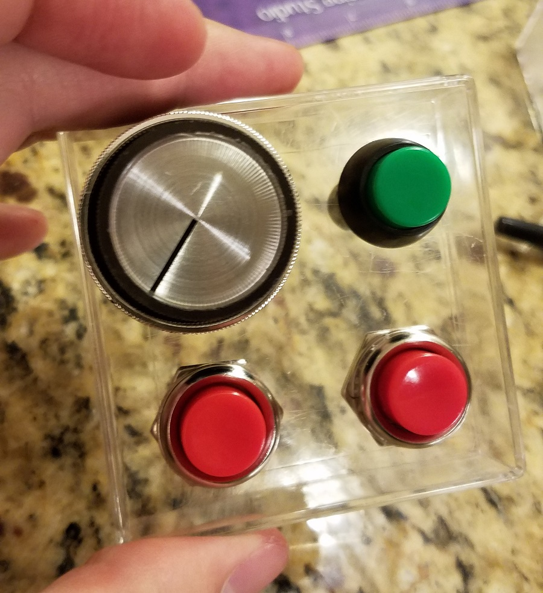
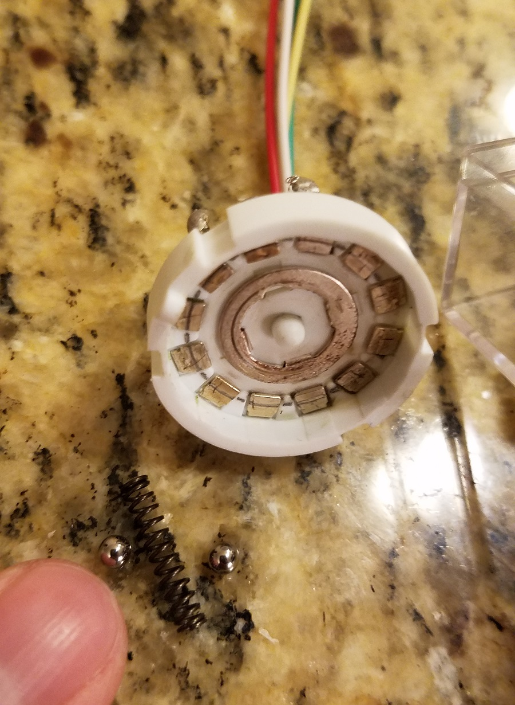

I recently built a custom arduino-powered controller.  It was a lot of fun and easier than I thought it might be.  If you're thinking of a similar project for yourself, perhaps this post will help or inspire you!

# Motivation
I got new music notation software that makes it easy to input notes from my digital piano, but controlling note duration is a bit clunky because I constantly have to switch between the piano keyboard and the computer keyboard.  This got me thinking if there was any way I could make this process smoother.  A custom controller perhaps?

I've had an [Arduino Uno](https://store.arduino.cc/usa/arduino-uno-rev3) sitting around for quite awhile, but I had never done much with it.  I've also accumulated various mechanical switches over the years, telling myself they'd eventually be used for some project.  What better project than a custom controller!

# Planning
The first thing I did was take inventory of the switches I had and which ones I wanted to use.  I selected a 12-position switch, a few toggle buttons, and a flip switch (which I decided to add later).

One thing I had to sort out was how to deal with all the leads on the 12-position switch.  Arduinos have a limited number of input pins, and I didn't want to burn them all up on one switch.  Since the switch can only be in one position at a time, I realized that the Arduino would only need to know which _direction_ the knob is being turned, and it could figure out the specific position based on how many left/right turns it detects.  Here's what I came up with, which reduces the 12 leads down to 3:

# Soldering
This reduction left me plenty of Arduino inputs for more switches.  So with that I started cutting/stripping/soldering wire segments to the switch:

Just as a sanity check, I made sure to test that my switch was working as expected at each intermediate step.  Using my Arduino and some LEDs, I wrote a quick program to display the current value of the switch in binary.  (This was before I discovered the Arduino serial monitor, which would have been much easier!):

# The Enclosure
Next, I needed some kind of box to mount all my switches into.  I didn't have many options in my small apartment, but I happened to have a plastic box from a toy gyroscope sitting around:

# Breaking the Switch
As you can see from the pictures above, everything was going smoothly... until I broke the 12-position while trying to shove the knob on:

At first I thought I had just destroyed all my progress, after having spent hours planning/cutting/stripping/soldering/drilling.  But it turned out that the switch was mostly OK, it just needed to be put back together.  Easier said than done however!  Some of these pieces were seriously tiny -- and worse -- spring-loaded:

This spring and two bearings are what kept the switch "snapped" into each position.  I couldn't get take a picture of the inner workings of the spring mechanism, but here's a diagram that should give you a rough idea of how it worked:

Due to it's design, the switch was very challenging to put together.  It took two full hours of wrestling with tiny spring-loaded bearings (and chasing after them when they launched out) to finally fix it:

# Arduino Nano
While I was working on all this I had ordered an Arduino Nano (or a cheap knockoff rather) to act as the brains of the controller.  It was much smaller than my Arduino Uno, but had the same number of pins and programming interface.

At this point I realized I had made another oopsie.  The new Arduino worked fine, but I realized that I was supposed to get the "Arduino Micro", not the nano.  The relevant difference is that the micro can be recognized by any computer as a HID (Human Interface Device), no drivers required.  I originally planned for the controller to just emit keyboard signals, but that wasn't a possibility anymore.

My only other option besides ordering the proper chip was to write a program that runs on the computer, listens for signals from the Arduino's serial port, and fire the appropriate keyboard signals.  I opted for the second option, which I'll talk about more later.

# Putting it All Together
Having decided to keep the nano, I drilled a hole for it in the box:

Next, I finished soldering wires to the remaining switches,

and hot-glued the arduino in place:

I purposely ordered an Arduino with pin headers so I wouldn't have to solder any wires directly onto the chip.  Plus, it would make it easy to swap in a new one if the chip ever crapped out on me, since I was taking a chance on a knockoff brand.  This made the final assembly very easy and less nerve-wracking:

# Final Product
That's it for hardware!  Here's a view of the finished product:

As mentioned, I had to futz around more on the software side to make it usable with my computer.  I chose to write the program in Node.js since that's what I'm familiar with, and luckily there were already two nice modules for [listening to the serial port](https://www.npmjs.com/package/serialport) and for [simulating keyboard events](https://www.npmjs.com/package/robot-js), which did most of the heavy lifting for me.

Without too much work, I built a program that could listen to the controller:

From there, it was quick to translate these signals into specific keyboard shortcuts that my music notation software would recognize:

Works like a charm!

# Conclusion
Overall, I'm very happy with the result.  Although having to launch a client program for the controller to be recognized is not as convenient as simply plugging in the device, it has the upside of being easier to reprogram, since Node.js is more flexible than C, which is what the Arduino is programmed with.

If you're considering an Arduino project but lack electrical experience (like me), something like this is a great place to start.  Other than when I was testing with LEDs, I didn't even need a single resistor for this project -- it's all just wiring and programming.

It was a fun project and I learned a lot.  Hopefully you learned something too!
