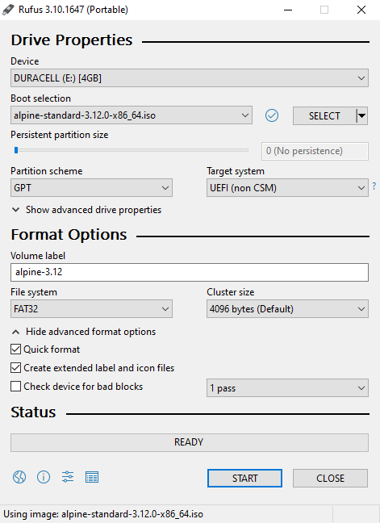
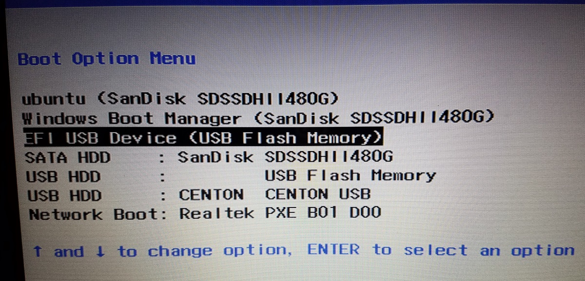
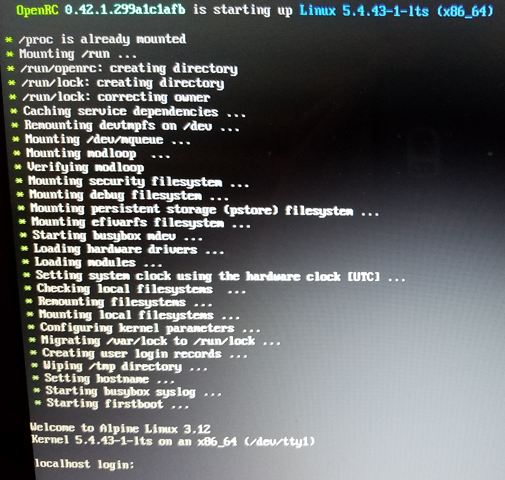
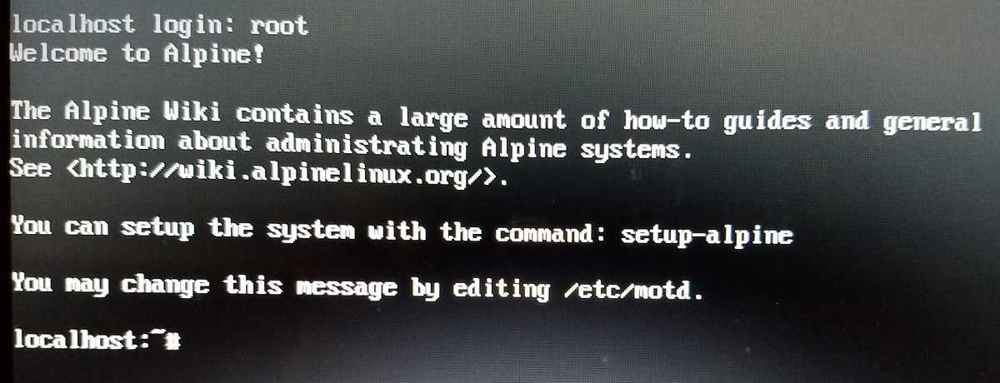
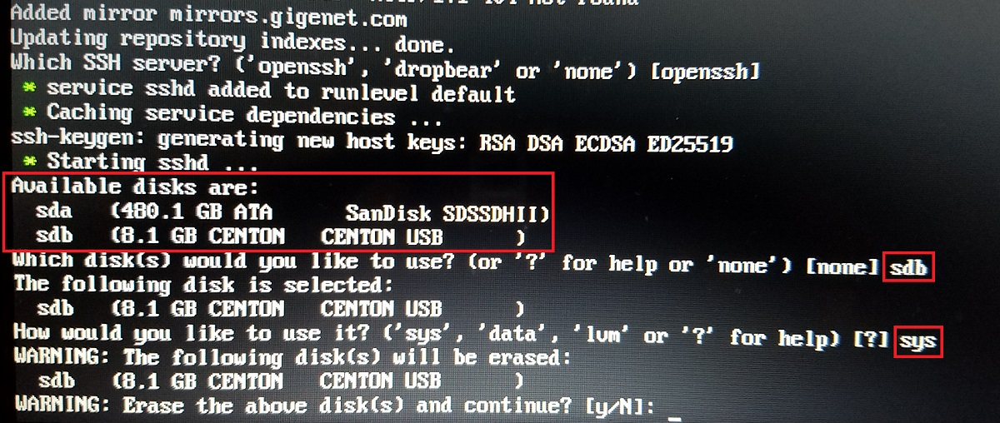
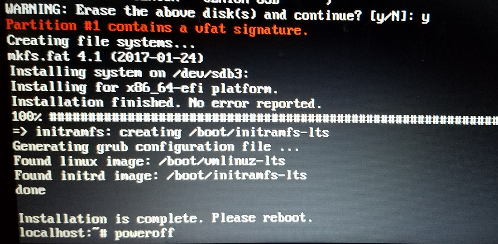
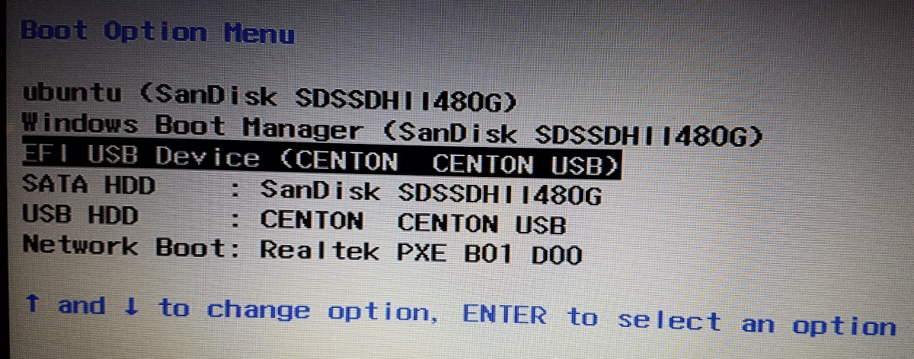

import Admonition from '../../../src/components/admonition';

Bootable USBs are useful to have in your tool belt and relatively easy to make.  Some USBs are "live," meaning they are a clean slate every time you boot in, and others have "persistence," meaning any changes you make will remain next time you boot in.  [Rufus](https://rufus.ie/) is a useful tool for creating both kinds of these USBs.  However, if you want persistence on less common Linux distributions, [Rufus may not be able to help you](https://github.com/pbatard/rufus/issues/1570).

While you _can_ add persistence to a live USB after it has been created, it requires lots of futzing in a terminal and may be too daunting of a task for non-linux-experts (myself included).  In this article I'll show you a simpler way to make a persistent Alpine Linux bootable USB.

# Prerequisites
* Familiarity with terminal interfaces and common Linux commands
* A Windows machine
* 2 free USB ports (important because we need to use both at the same time)
* 2 USB drives (one will be a _live_ Alpine USB that we use to install Alpine to the second USB drive, with persistence)

<Admonition type="warning">
	Note that several steps in this article have potential to erase valuable data and/or put your computer in an unusable state if followed incorrectly. Please read instructions carefully and use good judgement. I do not take any responsibility if you wreck your computer.
</Admonition>

# Preparing the Live USB
First, we'll need to download a few things:
* [Rufus](https://rufus.ie/). I prefer the portable version, but any version should work fine.
* An Alpine Linux ISO file. [I got mine here.](https://alpinelinux.org/downloads/) If you are unsure which variant to get, Standard x86_64 is probably the way to go.

Next plug in the USB drive you intend to use as the temporary live USB (_not_ the one you plan to use as the persistent USB). Ensure that Windows recognizes the drive and there's nothing on the drive you care about losing (because it will be erased).

Now start up Rufus and set the following configurations:

* **Device** - The USB drive for the temporary live Alpine installation (mine is called `DURACELL (E:)`)
* **Boot selection** - The Alpine ISO file you downloaded earlier (mine is version 3.12, but yours may be newer)
* **Persistent partition size** - Set to 0 (this is going to be the live USB)
* **Partition scheme** - Set to GPT
* **Volume label** - Not required, but helpful so you remember what the USB drive is later
* **File system** - Set to FAT32

All other defaults should be fine. Triple check that you've selected the correct USB device, then click the "START" button when you're ready.  The process will take a few minutes.  If all goes well, you now have a live (non-persistent) Alpine Linux Bootable USB!

# Preparing the Persistent USB
With our live USB prepared, we can now make the persistent USB. First, completely shutdown your Windows machine (hold <kbd>shift</kbd> while clicking through the shutdown menu). While the machine is off, insert both the live USB we just prepared, and the persistent USB we are going to prepare.  Now power on the machine and enter the BIOS menu.

<Admonition type="info">
	Entering the BIOS menu is a different process for every machine, so you'll need to find instructions specific to your computer.
</Admonition>

In the BIOS menu, identify the live USB and boot into it. If you have many boot devices this may be tricky. The name can vary, but mine was called "EFI USB Device":

Upon booting, you should see a black screen with "GNU GRUB" at the top. Hit <kbd>enter</kbd> to continue (or it will continue automatically after 10 seconds). If all is well, you should see some startup logs followed by a login prompt:

The default user is "root" with no password, so just type "root" and hit <kbd>enter</kbd>:

## The `setup-alpine` Script
From here, we can run a builtin setup script to install a persistent version of Alpine Linux to the other USB drive. This command has many prompts that take values specific to your situation, so I can't list the exact steps, but I will hit the key points below. If you run into issues, the [Alpine setup scripts wiki](https://wiki.alpinelinux.org/wiki/Alpine_setup_scripts) is a good place to start for troubleshooting.

<Admonition type="warning">
	Once again, please be warned that these commands can wipe out your computer if used incorrectly. Read prompts carefully and use good reasoning.
</Admonition>

* Run the `setup-alpine` command. For any prompts I don't describe below, accept the default value
* Choose the appropriate keyboard layout
* Accept default system hostname
* Initialize network interfaces: your choices will likely be `eth0` and `wlan0` (ethernet and wifi). You can setup either (or both), but `eth0` is simplest (assuming you have a wired connection already). If you choose to set up wifi, be sure to enter the network SSID and PSK (wifi password) exactly.

<Admonition type="question">
	I have had issues setting up wifi when many wireless networks are available. For example, at my parents' place in a rural area, the network interface setup worked fine. At my apartment in the city, it failed. My brief research suggested that scanning for available wireless networks overwhelms the command when there are too many available.
</Admonition>

* Unless you know better, when asked to provide an IP address for the interface, choose `dhcp`. This tells the router to automatically assign you an IP when you connect
* You'll be prompted for a new password for the `root` user. Choose whatever you'd like
* After a few more prompts you'll be asked to choose an APK repo mirror from a large list. Enter `f` to have the script automatically find the fastest one for you.
* Accept default SSH server

**You need to be especially careful on this next step.**  I've highlighted key details:

* We will be asked to choose a disk to install to.  I have two disks listed on my machine (`sda` and `sdb`), but yours may look different. Identifying the USB drive should be easy if you already know the storage capacity and/or the brand.  In my case, I have an 8GB Centon USB drive, so `sdb` is the drive I want to choose.  `sda` in this case is my laptop's internal hard drive, which I _do not_ want to choose because the drive we select will be cleared and overwritten.
* We will also be asked how the disk should be used. Choose `sys` for a full Alpine system installation.

This final step will take some time. On my machine, some commands hung for several minutes at a time -- be patient.  When the installation is complete, you can shutdown the machine with the `poweroff` command.

# Using the Persistent USB
While the machine is powered off, remove the _live_ Alpine USB and keep the _persistent_ USB plugged in.

<Admonition type="info">
	We're completely done with the live Alpine USB now -- just the persistent USB is needed from now on.  You may repurpose the live USB drive, or use it as a "seed" to create additional persistent Alpine USBs.
</Admonition>

Power on the machine and enter the BIOS menu once more.  Again, the device names aren't entirely predictable, but the persistent USB was "EFI USB Device (CENTON  CENTON USB)" in my case:

If all is well, you'll be able to boot into the persistent USB just like the live USB, only this time you'll need to use the root password you set earlier.  There's no need to run `setup-alpine` this time -- all the configurations we made earlier were applied to the persistent USB.

Now you may install packages, write files, etc., and all your changes will survive reboots. (You can double check by creating a file, rebooting, and seeing if the file is still there.)

That's all there is to it.  Hopefully you found this useful!
